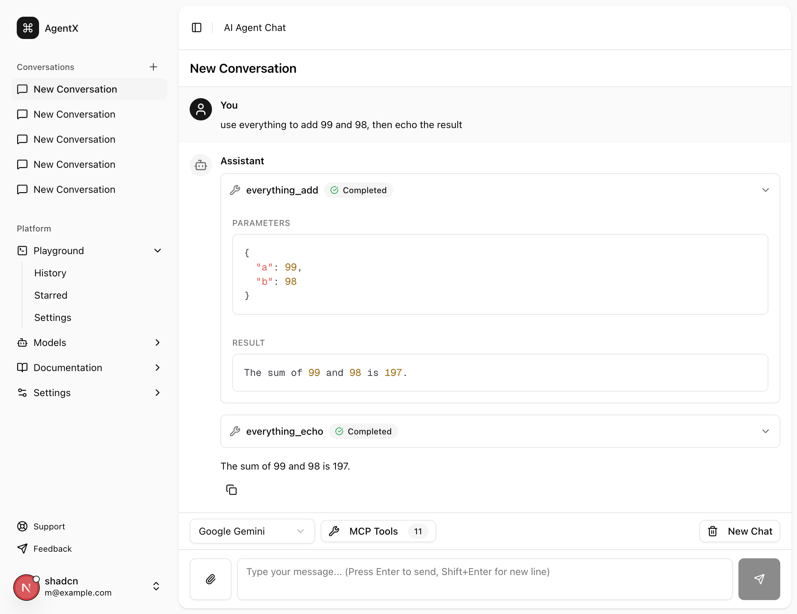

# Next.js AI Agent

A modern AI chatbot application built with Next.js, AI SDK v5, and Tailwind CSS. Features a clean chat interface with support for multiple AI models (OpenAI and Google Gemini) and tool calling capabilities.



## Features

- 🤖 **Multi-Model Support**: Switch between OpenAI GPT-4o and Google Gemini models
- 🛠️ **Tool Calling**: Built-in tools for weather, time, calculations, and information search
- 💬 **Real-time Streaming**: Stream responses from AI models in real-time
- 🎨 **Modern UI**: Clean, responsive chat interface with tool call visualization
- 📝 **Message History**: Messages are stored in the frontend for conversation continuity
- 🔧 **Modular Components**: Well-organized component structure for easy maintenance

## Tech Stack

- **Framework**: Next.js 15.5
- **Runtime**: Bun
- **AI SDK**: ai-sdk v5 with @ai-sdk/react, @ai-sdk/openai, @ai-sdk/google
- **Styling**: Tailwind CSS with Shadcn/ui components
- **Language**: TypeScript
- **Validation**: Zod
- **Icons**: Lucide React

## Project Structure

```
├── app/
│   ├── api/
│   │   └── chat/
│   │       └── route.ts          # Chat API endpoint with tool definitions
│   ├── layout.tsx                # Root layout with Toaster
│   └── page.tsx                  # Main page with chat UI
├── components/
│   ├── chat/
│   │   ├── chat-container.tsx    # Main chat container with controls
│   │   ├── chat-input.tsx        # Message input component
│   │   ├── chat-messages.tsx     # Messages list with auto-scroll
│   │   ├── message-item.tsx      # Individual message wrapper
│   │   ├── message-content.tsx   # Message content renderer (text + tools)
│   │   └── index.ts              # Export barrel
│   ├── ui/                       # Shadcn/ui components
│   └── app-sidebar.tsx           # Application sidebar
└── lib/
    └── utils.ts                  # Utility functions (cn, etc.)
```

## Getting Started

### Prerequisites

- Bun installed on your system
- OpenAI API key (for GPT-4o model)
- Google AI API key (for Gemini model)

### Installation

1. Clone the repository:

```bash
git clone <your-repo-url>
cd nextjs-ai-agent
```

2. Install dependencies:

```bash
bun install
```

3. Set up environment variables:

Copy the `.env.local` file and add your API keys:

```env
# OpenAI API Key
OPENAI_API_KEY=your-openai-api-key-here

# Google Gemini API Key
GOOGLE_GENERATIVE_AI_API_KEY=your-google-api-key-here

# Default model provider (openai or google)
DEFAULT_MODEL_PROVIDER=openai
```

4. Run the development server:

```bash
bun dev
```

5. Open [http://localhost:3000](http://localhost:3000) in your browser.

## Available Tools

The AI agent has access to the following tools:

- **getWeather**: Get current weather information for a city
- **getCurrentTime**: Get current date and time for a specific timezone
- **calculate**: Perform basic mathematical calculations
- **searchInfo**: Search for information on various topics

## Usage

1. Select your preferred AI model (OpenAI or Google Gemini) from the dropdown
2. Type your message in the input field
3. Press Enter or click the send button
4. Watch as the AI responds and uses tools when appropriate
5. Tool calls and results are displayed with visual indicators

## Development

### Build

```bash
bun run build
```

### Lint

```bash
bun run lint
```

### Start Production Server

```bash
bun start
```

## Architecture Decisions

### Backend

- **AI SDK v5**: Uses the latest AI SDK for streaming and tool calling
- **Route Handler**: API route at `/api/chat` handles all chat interactions
- **Tool System**: Tools are defined with Zod schemas for type-safe validation
- **Multi-Model**: Supports switching between OpenAI and Google models dynamically

### Frontend

- **React Hooks**: Uses `useChat` hook from @ai-sdk/react for state management
- **Component Splitting**: Chat UI is split into small, focused components
- **Real-time Updates**: Messages stream in real-time with proper rendering
- **Tool Visualization**: Tool calls and results are clearly displayed
- **Auto-scroll**: Messages automatically scroll to bottom on new content

## Contributing

Feel free to open issues or submit pull requests for improvements.

## License

MIT
